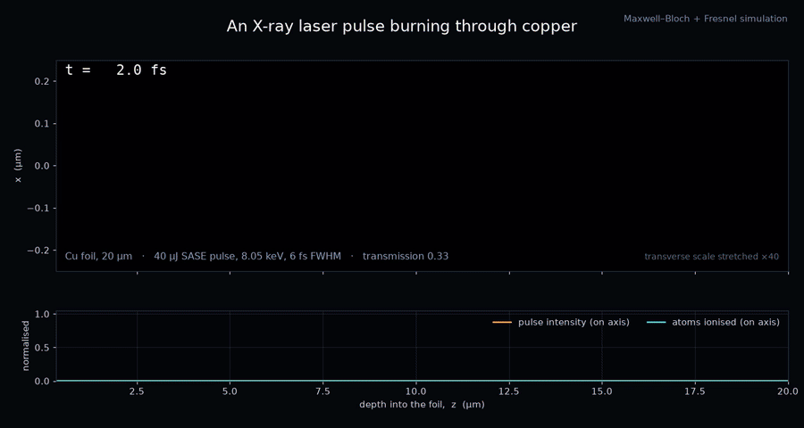
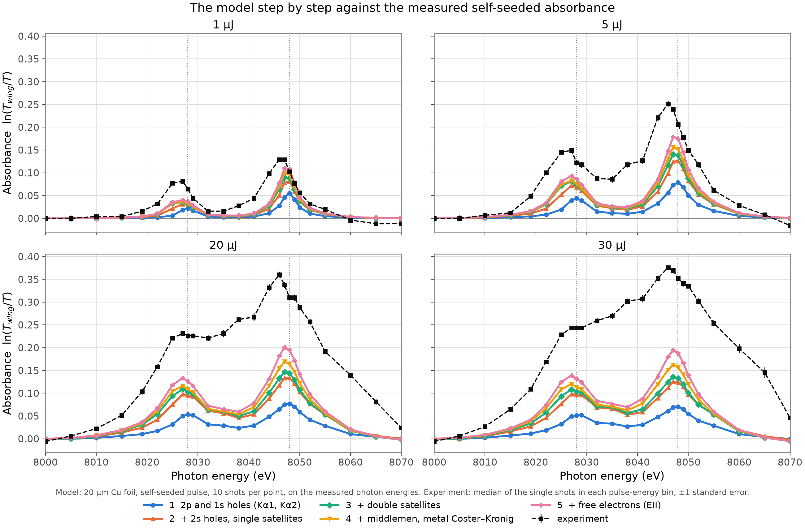

# Cu-RSA-XFEL-Simulation

Simulation of **reverse saturable absorption** in copper hit by intense **X-ray free-electron-laser** pulses,
built during a research internship at **DESY**. A femtosecond X-ray pulse tuned to the copper Kα line ionises
the foil as it crosses it, and the ions it leaves behind absorb more strongly than neutral atoms, so the foil
darkens the harder it is hit. The code follows the pulse and the atoms together: a Maxwell–Bloch model of the
core-hole states of every ion, coupled to the propagation of the X-ray field through the foil in (t, x, y, z).



**[Interactive write-up with the full animations →](https://p4gan.github.io/Cu-RSA-XFEL-Simulation/)**  ·  **[Usage guide](docs/usage.md)**

## What the model contains

- **Maxwell–Bloch core**: the 2p₃/₂, 2p₁/₂ and 1s holes of each ion in one sublevel-resolved density matrix, so
  Kα1 and Kα2 absorption and stimulated emission come out of the same equations, driven by the local field.
- **Field propagation**: split-step Fresnel diffraction and photoabsorption between z planes, plus the field the
  atomic coherences radiate. SASE pulses from [OCELOT](https://github.com/ocelot-collab/ocelot), optionally
  filtered through the Si(111) monochromator of the self-seeded experiment.
- **Satellite ions**: ions with one or two spectator 3d/3p holes, each a detuned density-matrix block fed by
  Coster–Kronig and Auger decay; a pool of valence-ionised "middleman" ions that keep absorbing; and the free
  electrons, which slow down through an energy ladder and ionise more atoms (electron-impact ionisation).
- **Numerics**: RK4 in time and a z-marching loop, with the density-matrix kernel JIT-compiled by Numba; batch
  sweeps run as SLURM array jobs on DESY's Maxwell cluster.

The five model steps against the measured self-seeded absorbance (I. Inoue et al.):



## Quick start

```bash
pip install -e .
python scripts/example.py      # one shot on a coarse grid, about two minutes on a laptop
```

```python
from xraymb_sim import Simulation

sim = Simulation("config/mono/5-electrons.yaml")
sim.configure()      # the incident pulse named in the config (gaussian, sase or sase_dcm)
sim.run()            # results: sim.Omega_pstxyz (field), sim.rho_ijtxyz (density matrix), ...
```

## Layout

```
xraymb_sim/   the package
  simulation.py   Simulation: config, grids, coupling tensors of the atomic model
  sample.py       the z-marching loop (full and memory-lean versions) and the RK4 step
  model.py        right-hand sides of the Maxwell–Bloch equations (Numba kernel), feeds, absorption
  optics.py       Fresnel propagation between z planes
  eii.py          free-electron slowing-down ladder and electron-impact cross sections
  pulses.py       Gaussian, SASE and monochromated SASE pulses
  analysis.py     spectra, per-shot sweep outputs, loading a finished sweep
  sweep.py        running many shots of one config on a cluster node
  plot.py         plots of one run
config/       mono/1-bare.yaml .. 5-electrons.yaml (the five model steps), sase/, movie.yaml, example.yaml
scripts/      sweep pipeline (generate_*_sweep.sh -> submit_sweep.sh -> run_sweep.py -> plot_*.py),
              movie and population-budget runs, example.py
xatom/        XATOM runs that produce the atomic parameters in the configs
data/experiment/  the measured self-seeded transmittance the model is compared with
notebooks/    plotting notebooks for earlier sweeps
```

## Running sweeps on the Maxwell cluster

From the repo root on a login node:

```bash
bash scripts/generate_final_sweep.sh     # writes the configs and prints the sbatch command
mkdir -p logs && sbatch --array=... scripts/submit_sweep.sh config/generated/final_sweep_mono
python scripts/plot_final.py             # once data/final_sweep_mono_<job id>/ is complete
```

`generate_sase_sweep.sh`, `generate_convergence_sweep.sh` and `generate_population_budget.sh` follow the same
pattern. Every output folder carries a copy of its config and the git commit it ran with.
[docs/usage.md](docs/usage.md) covers the config keys, the sweep families and reading the results.

## Requirements

Python ≥ 3.9 with numpy (< 2), scipy, matplotlib, pyyaml, h5py, numba and ocelot-collab, installed by
`pip install -e .`.
