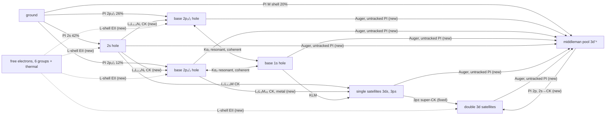

# Model changes, 14–17 September 2026: the physics

What changed in the Cu RSA model physically, step by step, why, and what each change did to the
comparison with experiment. The code side of the same changes is in
`docs/model-changes-2026-09-code.md`. Derivations and estimates are in the Part VI and Part VII theory
docs (`docs/theory-middlemen-and-pathway-audit.md`, `docs/theory-eii-and-free-electrons.md`); this
document summarises them and adds everything built after them.

All energies are photon energies unless stated. "Dip" or "line depth" means the resonant absorbance at
the Kα₁ line, A = ln(T_wing/T), with the non-resonant photoionisation background divided out. "Mono"
is the self-seeded, DCM-monochromated beam; "SASE" is the broadband beam measured with a spectrometer.

---

## 0. The model before these changes

The starting point is the double-satellite model on `main` (commit ff828c4, 15 September).

- **Resonant block.** One density matrix per (x, y, z) point holds the 2p₃/₂-hole manifold (4
  sublevels), the 1s-hole manifold (2 sublevels) and the 2p₁/₂-hole manifold (2 sublevels). The field
  drives the Kα₁ (1s ↔ 2p₃/₂) and Kα₂ (1s ↔ 2p₁/₂) transitions coherently (Maxwell–Bloch), so
  stimulated absorption, stimulated emission, saturation and coherent effects are all in.
- **Incoherent populations.** Ground, 2s hole and "other" (M-shell holes) are scalars.
- **Photoionisation of ground atoms** at 8 keV (below the K edge) makes 2s holes (42% of absorbed
  photons), 2p₃/₂ holes (26%), 2p₁/₂ holes (12%) and M-shell holes (20%, "other").
- **Satellites.** A 2s hole decays by L₁–L₂,₃M Coster–Kronig (CK) into a 2p hole plus an M-shell
  spectator hole (3d± or 3p±). Each spectator configuration is its own detuned copy of the resonant
  block, because the spectator shifts the Kα lines by roughly −1 to +3 eV. The 3p± spectators decay
  further (super-CK) into double-3d spectator blocks. The 1s hole feeds satellites by KLM Auger, and
  core-holed atoms feed them by photoionisation of an M-shell electron.
- **Propagation.** The field is propagated through the foil (Fresnel with absorption); the source term
  from the coherences adds stimulated emission to the field.

Three things were wrong with it (Part VI audit, 14 September):

1. **It created population.** Explained in step 1.
2. **Most decays went nowhere.** When a 2p hole, 1s hole, 2s hole or satellite decayed by Auger, the
   atom simply left the model. It stopped absorbing and was never ionised again. At 30 µJ up to 19% of
   the atoms at the exit face had vanished. That made the non-resonant wing *brighten* with pulse
   energy, while the measured wing darkens.
3. **It sat on a hard ceiling far below the data.** Once the resonance saturates, each 2p₃/₂ hole can
   remove only η ≈ 0.39 resonant photons, and each absorbed photon makes only f ≈ 0.52 Kα₁-type holes.
   The line depth then saturates at about η·f·κL ≈ 0.18, with κL ≈ 0.90 the non-resonant optical depth.
   The measured depth saturates at about 0.37.

---

## 1. Every feed must be a branch of its source (population conservation)

**What was wrong.** A 3p± spectator hole on a 2p-hole atom decays by super-Coster–Kronig (3p⁻¹ →
3d⁻²) in about 0.2 fs, turning a single-3p satellite into a double-3d satellite. The model added this
feed to the daughter blocks but did not subtract it from the parent. To "make room" for the feed, the
parent's widths had instead been reduced by the feed rate. The parent therefore decayed at the reduced
width, and the daughters were fed at the full rate. Each decayed 3p± parent made 1.1–2.5 daughter
atoms, where the physical number is 0.53–0.72, and the parents lived about 3× too long.

**The rule now.** A population decays at its full physical width. Any feed into another tracked
population is a *branch* of that width, never a reduction of it. The 2s pathway was already written
this way (full Γ_L₁ = 8.13 eV decay, plus additive CK feeds).

**What changed.** The 3p± parents' widths were restored to their totals, for example the 2p₃/₂⁻¹3p₃/₂⁻¹
L manifold from 0.893 to 2.632 eV. These equal XATOM's own widths for those configurations. The code
now refuses any configuration in which the feeds out of a population exceed its decay.

**Effect.** The fixed model's dip is shallower by about 0.01–0.014 in T at 5–30 µJ. Every
double-satellite result from before 15 September overstates the dip by that much.

---

## 2. Nothing vanishes: the middleman pool

**Physics.** Nearly every absorbed photon ends, within about 1 fs, in an ion with only 3d holes.
XATOM's Auger tables give:

- A 2p₃/₂ hole decays to 3d⁻² (33%), 3p⁻¹3d⁻¹ (31%), 3p⁻² (26%) or 3s-containing states (8%).
- A 3p hole collapses to 3d⁻² in about 0.2 fs (super-CK), and a 3s hole similarly.
- A 3d hole has no Auger channel at all: filling it from 4s releases too little energy.

So after one L-shell event the atom is a 3d⁻ⁿ ion with n ≈ 2–6 (mean 2.9 for a 2p₃/₂ decay, about 6
for a K hole via KLL), and it stays one for the rest of the pulse. These ions are the "middlemen".

- **They still absorb.** At 8 keV absorption is dominated by the L shell, which the 3d holes barely
  touch: XATOM gives 1.00–1.03× the neutral cross section for 3d⁻¹ to 3d⁻⁶.
- **They still make 2p holes.** Photoionising a middleman makes a 2p hole with 3d spectators, i.e. a
  satellite. Its Kα lines are those of the multi-3d-spectator configuration, not of the bare atom.

**How it is represented.** One scalar population per (x, y, z), `rho_mid`.

- **Feed.** Every decay and further photoionisation that has no other tracked destination ("untracked
  outflow"):
  - Auger decay of the base 2p₃/₂, 2p₁/₂ and 1s holes, and of every satellite block.
  - The 2s-hole decays that are not CK into a tracked satellite (L₁–MM Auger).
  - Further photoionisation of core-holed atoms that does not land in a satellite.
  - M-shell photoionisation of ground atoms. This used to fill "other", which is no longer pumped.
- **Absorption.** Like the ground state (same cross section).
- **Photoionisation into satellites.** Photoionising the 2p₃/₂ or 2p₁/₂ shell of a middleman makes a
  2p hole in the double-3d satellite blocks. The hole is split over 3d+3d+ : 3d−3d+ : 3d−3d− by
  statistical weight (0.333 : 0.533 : 0.134), the closest existing configurations to n ≈ 3. It lands
  with the same sublevel pattern as ground-state photoionisation. A 2s hole on a middleman
  Coster–Kronigs within 0.08 fs into the same blocks, with the same CK fractions as a neutral 2s hole.
  M-shell photoionisation, and the rest of the 2s decay, return the ion to the pool.

With the pool on, the tracked populations sum to 1 to integrator accuracy. That check is now the main
diagnostic that nothing is created or lost.

**Effect.**

- **Wing.** Measured mono T at 8000 eV goes 0.410 → 0.392 from 0.1 to 30 µJ. The old model went
  0.4075 → 0.4245; with middlemen it goes 0.4073 → 0.3880. SASE at 40 µJ: 0.360 against 0.349 measured
  (0.388 before).
- **Dip.** T(8048 eV) at 20 µJ drops by 0.019 (one Maxwell–Bloch shot, against 0.019 in the
  rate-equation estimator). Whether the middlemen's 2p holes resonate at the double-3d satellite lines
  (0.019) or not at all (0.015) matters little at the line centre.
- **Limit.** Middlemen do not raise the saturated ceiling, because photoionising an ion makes the same
  number of 2p holes per absorbed photon as photoionising a neutral atom.

---

## 3. Two Coster–Kronig connections that the metal opens

Both feed populations that already exist, as branches of existing widths.

1. **2p₁/₂ → 2p₃/₂ + 3d hole (L₂–L₃M₄,₅ CK).** Energetically closed in the free atom (XATOM Γ_L₂ =
   0.666 eV) but open in the metal, where the measured Γ_L₂ = 1.04 eV includes it. The difference,
   0.374 eV, is routed from the base 2p₁/₂ hole into the 3d+ and 3d− satellites' 2p₃/₂ manifolds (0.6 :
   0.4). A Kα₂-type hole thereby becomes a Kα₁-type absorber.
2. **2s → 2p + 4s hole (L₁–L₂,₃N₁ CK).** XATOM's `2s0 → 2p± 4s0` rows. The 4s spectator is refilled
   from the conduction band within the 2p-hole lifetime, so these land on the *bare* base holes:
   0.0903 eV into 2p₃/₂ and 0.0508 eV into 2p₁/₂, out of Γ_L₁ = 8.13 eV.

**Effect.** Together with the middlemen, T(8048, 20 µJ) drops by 0.024 in total from the step-1
baseline.

---

## 4. Free electrons and electron-impact ionisation (EII)

**Physics.** Every absorbed photon releases a 7.0–8.0 keV photoelectron. Other sources:

- Every L-shell Auger decay releases a ~0.87 keV electron.
- Every non-radiative 1s-hole decay (KLL/KLM) releases a ~7.1 keV electron.
- Coster–Kronig decays release slow (~60 eV) electrons.

In solid Cu a 7 keV electron loses its energy in about 8.5 fs over about 290 nm of path; a 0.9 keV one
in about 1 fs. On the way it ionises. Over its whole slowing-down, one 7 keV primary makes 0.11 2p₃/₂,
0.05 2p₁/₂ and 0.035 2s holes, and about 63 3d ionisations. The 0.87 keV Auger electrons are below
the L-shell thresholds and can only ionise the M shell.

**How it is represented.** A slowing-down ladder of free-electron populations per (x, y, z):

- **Groups.** Six log-spaced energy groups from 7.1 keV to 30 eV, plus a thermalised bin (< 30 eV) that
  no longer ionises. Electrons are counted per atom.
- **Production.** Each process above deposits one electron into the group of its birth energy
  (photoelectron 7.09 keV, KLL 7.1 keV, LMM 870 eV, CK 60 eV). Each EII event adds a slow secondary.
- **Slowing down.** Electrons flow from each group to the next at the continuous-slowing-down rate
  (Joy–Luo stopping power for Cu). There are no fixed-energy electrons and no thermalisation time
  parameter: with fixed energies the L-shell yield came out 4× too high over a 45 fs window.
- **Ionisation rates.** Burgess–Chidichimo cross sections with XATOM binding energies, n σ v per
  group. They reproduce the reference slide's 65 / 11 / 2.3 / 0.21 fs lifetimes for 2p₃/₂ / 3s /
  3p / 3d at one 7 keV electron per atom.
- **Sinks.**
  - L-shell EII of ground atoms makes base 2p₃/₂ and 2p₁/₂ holes (spread evenly over sublevels,
    since a fast projectile selects none) and 2s holes.
  - L-shell EII of middlemen follows the middleman routing into the satellites.
  - M-shell EII of ground atoms feeds the middleman pool, scaled by `M_shell_scale`. The reference
    model sets it to 0: in the metal a single valence-3d excitation delocalises instead of staying on
    the atom as a hole.
- **Transport.** Electrons leave the focus (100 × 170 nm) long before they stop. Instead of transport,
  a `spatial_factor` = 0.5 keeps half of the EII events in the focus.

**Not included:** M-shell EII of atoms that already have a core hole (which would turn base holes into
satellites), and the electrons of the M-shell cascade after an L-shell Auger decay.

**Effect.** +10% on the dip at spatial factor 0.5 (T(8048, 20 µJ) −0.0055), and +19% with no transport
loss (factor 1). EII scales linearly with pulse energy, so it scales the whole curve rather than adding
high-intensity absorption. The bracket sweep's "all EII events in the focus" variant closes 9% of the
20–30 µJ gap.

---

## 5. The first z plane is photoionised

**What was wrong.** The photon flux that drives photoionisation at each plane was only written *after*
that plane was integrated, so plane 0 saw zero flux: no holes, ground population 1, while the same
incident field still drove its coherent Kα coupling. This is an O(dz) error. It changed T by −0.0016
at 60 µJ with 30 planes, and by twice that with 15 planes (the mono grids).

**Fix.** Plane 0's flux is computed from the incident field. In the fixed model the SASE line is about
4% deeper. Every result from before 16 September has the old behaviour.

**Not changed.** The transmitted field is still read after N−2 of the N−1 propagation steps (an
effective foil of 18.6 instead of 20 µm). That effect is about 8× larger (+0.013 in T at 30 planes) and
is still pending.

---

## 6. The 2p₃/₂ dark state: two tests

**Physics.** A linearly polarised field couples each 1s sublevel to two 2p₃/₂ sublevels (Δm = ±1)
at once. The field then pumps each such pair into the one coherent superposition that no longer
couples to it, a dark state, so part of every 2p₃/₂-hole population stops absorbing until it decays.
Maxwell–Bloch gives 0.39 resonant photons absorbed per 2p₃/₂ hole at saturation, against 0.63–0.64 if
the sublevel coherences are removed (sublevel rate equations). This is the largest nonlinear effect in
the model, and it acts only above saturation (≳1 µJ mono), exactly where model and experiment part
ways.

Physically the dark state could be broken where the 2p hole couples to an open 3d shell. In a
satellite configuration the 2p–3d exchange splits the levels by 1–2 eV and scrambles the m-sublevels
on a sub-femtosecond timescale.

**Test A: sublevel mixing** (`L3_sublevel_mixing_*`, 15–16 September). A depolarising term relaxes each
2p₃/₂ manifold towards equal sublevel populations at rate γ, in the base block, the satellite blocks,
or both. In its Lindblad form it also damps the coherences between 2p₃/₂ sublevels at γ, and the
optical 1s–2p₃/₂ coherence at γ/2. The latter broadens the line by 2ħ(γ/2) ≈ 1.3 eV FWHM at
2 fs⁻¹. A `coherence_factor` of 0 keeps only the population exchange.

- **Lindblad, 2 fs⁻¹, all blocks:** mono 20 µJ line depth 0.160 → 0.199 (measured 0.368). In SASE at
  2 µJ it lowers the peak while conserving the area, which is the broadening at work.
- **Population exchange only:** closes only 5–11% of the gap. This is now understood: the dark state
  is a *coherence* between sublevels, not a population imbalance, and equalising populations leaves
  it intact.

**Test B: Raman dephasing** (`sublevel_raman_dephasing_fs_inv`, 17 September). Extra pure dephasing of
only the 2p–2p (including 2p₃/₂–2p₁/₂) and 1s–1s coherences, in every block. The optical 1s–2p
coherences, and therefore the line width, are untouched. This is the clean dark-state lever. In a
single-atom check with the real kernel at 10 fs⁻¹, photons absorbed per 2p₃/₂ hole at saturation go
0.39 → 0.60 (rate equations 0.64), while the weak-field line shape is unchanged to 2×10⁻⁴.

Both tests are phenomenological upper bounds. The coherence sweep (R, Raman dephasing, extra optical
broadening via `additional_dephasing`, and both; `scripts/generate_coherence_sweeps.sh`) measures what
they do to depth, width and area together.

---

## 7. Double-L-hole absorbers: 2s⁻¹2p⁻¹ and 2p⁻²

**Physics.** Two states with two L holes can absorb resonantly on the blue side, where the seeded data
show absorption switching on at 10–20 µJ:

- A 1s hole decays by KLL Auger into 2s⁻¹2p⁻¹ (0.158 eV of Γ_K) or 2p⁻² (0.407 eV).
- A 2p-hole atom can lose a second 2s or 2p electron to photoionisation.

XATOM ΔSCF puts their Kα-type lines at:

| State | Kα₂-type line | Kα₁-type line | Widths (L / K) |
|---|---|---|---|
| 2s⁻¹2p⁻¹ | 8054 eV | 8075 eV | 5.9–6.4 / 5.7 eV |
| 2p⁻² | 8063 eV | 8083 eV | 1.5 / 2.0 eV |

**How it is represented.** Two more satellite blocks, fed as branches:

- KLL branches of the 1s-hole width.
- XATOM subshell branching fractions multiplied by the cross sections the configs already use for
  further ionisation of 2p- and 1s-hole atoms.
- A new feed from a 2p₃/₂-hole atom into the 2p₁/₂-hole manifold of the 2p⁻² block, since losing a
  2p₁/₂ electron is what makes the resonance measured near 8060 eV.

Their decays go to the middleman pool.

**Effect: none measurable.** T changes by at most 6×10⁻⁴ anywhere between 8040 and 8090 eV, up to
80 µJ. The blocks hold about 3% of the core-hole population. The pre-run estimate (A(8063) ≈ 0.2 at
80 µJ) was about 1000× too high. These absorbers are not the measured blue shoulder.

---

## 8. Bookkeeping detail: sublevel pattern of photoionisation feeds

The further-ionisation cross section of a 2p₃/₂- or 1s-hole atom differs between sublevels (0.70–1.41×
the manifold mean over the four 2p₃/₂ sublevels, 0.75/1.25 over the two 1s sublevels). A feed that
is a branch of that ionisation, such as M-shell photoionisation of a 2p-hole atom into a satellite,
now carries the same sublevel pattern. Without this, a sublevel whose feeds exceed its own ionisation
could have negative untracked outflow even when the manifold average is fine. The effect on T is
below 10⁻⁷.

---

## 9. The reference model R

`config/base/Cu-seed-{SASE,mono-SASE}-middlemen-eii.yaml`. This is what "R" means in every sweep since
16 September.

Every photoionisation and every non-radiative decay (Auger, Coster–Kronig) also emits an electron into
the ladder (dotted arrows are EII). "Untracked PI" is further photoionisation of a core-holed atom that does not land
in a satellite.

| Process | Parameter (R) | Source |
|---|---|---|
| Ground photoionisation 2s / 2p₃/₂ / 2p₁/₂ / M | 2.45 / 1.52 / 0.69 / 1.20 ×10⁻⁷ nm² | paper totals, XATOM split |
| Widths 2p₃/₂ / 2p₁/₂ / 1s / 2s | 0.61 / 1.04 / 1.49 / 8.13 eV | literature (metal) |
| Single satellites | 3d+, 3d−, 3p+, 3p− | XATOM detunings and feeds |
| Double satellites | 3d+3d+, 3d−3d+, 3d−3d− | XATOM; 3p± parents at total widths |
| Middleman pool | absorbs like ground; 2p holes → double satellites 0.333 : 0.533 : 0.134 | Part VI |
| L₂L₃M₄₅ CK (metal) | 0.374 eV → 3d+ : 3d− = 0.6 : 0.4 | Γ_L₂(metal) − Γ_L₂(XATOM) |
| 2s → bare 2p₃/₂ / 2p₁/₂ (4s refilled) | 0.0903 / 0.0508 eV | XATOM |
| EII ladder | 6 groups 7.1 keV → 30 eV; spatial factor 0.5; M-shell EII off | Part VII |
| Sublevel mixing, Raman dephasing, extra broadening | 0 (off) | tests only |

---

## 10. What the changes did, and where the model stands

Line depth A(8048 eV), mono, 20 µJ, from the 15 September pathway sweep (before the J(z=0) fix). Each
row adds to the one above, except the last model row, which replaces the one before it:

| Model | A(8048), 20 µJ |
|---|---|
| double satellite, feed bug fixed | 0.126 |
| + middlemen + CK feeds | 0.145 |
| + L-shell EII | 0.160 |
| + sublevel mixing 2 fs⁻¹ (Lindblad), satellites only | 0.181 |
| + the same in all blocks | 0.199 |
| **experiment** | **0.368** |

R after the J(z=0) fix, from the bracket sweep, against the digitised seeded data:

| µJ | R depth | measured depth | R band area 8012–8072 eV | measured band area |
|---|---|---|---|---|
| 1 | 0.101 | 0.121 | 1.0 eV | 2.6 eV |
| 5 | 0.159 | 0.227 | 2.4 eV | 5.3 eV |
| 20 | 0.174 | 0.366 | 3.6 eV | 12.2 eV |
| 30 | 0.168 | 0.359 | 3.8 eV | 13.6 eV |

- **SASE at 40 µJ** (precise data): the line-centre depth now matches (0.60 vs 0.63), but the measured
  line is ~3× wider (14 vs 4.9 eV FWHM) with 2.2× the area.
- **No single bracket closes the gap.** One-at-a-time changes within the model's uncertainties close
  at most ~10% of the 20–30 µJ gap: sublevel population mixing, all EII in the focus, satellites at the
  bare lines, GRASP atomic data, a 2× smaller focal area, and a 10 µm foil.
- **What the data require.** At high fluence the experiment absorbs about 2.1× more resonant photons
  per absorbed photon than the model allows, spread over a 2–3× wider band. The mechanism must change
  how many photons each 2p hole absorbs (the dark state is the largest identified lever, up to ×1.6),
  not merely add hole-making pathways.

---

## 11. Known gaps and next steps

**Still not in the model:**

- **Solver:** the readout off-by-one (§5).
- **Grids:** the SASE base configs' 3×3 transverse grid puts 0.67× the fluence on axis. Use 5×5 when
  comparing with experiment.
- **Cascade products:** KLL products that keep a 2p hole after one L-shell Auger step (2p⁻¹3d⁻²
  absorbers) go straight to the middleman pool; estimated +10–15% on the hole population. M-shell EII
  of core-holed atoms is also missing.
- **Charge states and multiplets:** no charge-state resolution of the middleman pool, whose Kα shifts
  are −0.85 eV per 3d hole and +2.8 eV per 3p hole in XATOM. No 2p–3d multiplet structure in the
  satellites; each is one detuned copy of the atomic block, with the base dipoles and radiative rates
  (spectator approximation).
- **Transport:** electron transport is replaced by `spatial_factor`.

**Running or ready to run:**

- **Coherence sweep:** Raman dephasing and homogeneous broadening, R vs dark state off vs broadened
  vs both.
- **Population-budget runs.** These record, at every depth and time step, the middleman pool, every
  satellite block, every electron energy group, and the transmittance (R and Raman dephasing; mono at
  8000/8048 eV, 1–50 µJ; SASE 2–40 µJ). The sweeps only ever kept the exit plane, where the pulse is
  already attenuated: in a test shot at 20 µJ the middleman fraction was 0.14 at the entrance against
  0.06 at the exit face.

---

## 12. Addendum, 26 September: a finer, non-thermal electron ladder

Explained in full in `docs/theory-eii-electron-ladder-explained.md`. Available as options, with the
reference configs unchanged:

- **24 levels instead of 6, each source born at the top of its own level.** The 6-level ladder had
  only 2 levels above the 2p threshold. Their exponential emptying pushed 2p EII holes late: 82% of
  the in-pulse holes of the exact slowing-down, against 93% now.
- **M-shell photoelectrons at 7.95 keV** instead of 7.09 keV (+17% 2p yield each).
- **No cut-off above the lowest threshold.** The ladder runs down to 16.5 eV (3d).
- **δ electrons.** Every ionisation by a ladder electron releases a secondary with a binary-encounter
  energy spectrum, and that secondary slows down and ionises in turn. This adds +3% to the L-shell
  EII. It closes energy to ~15%, at about one electron per 30 eV deposited.
- **Fixed-energy bound.** One level per source, no slowing down. It makes 5× more 2p holes per
  electron in total, but only ~10% more while a 6 fs pulse is present.
